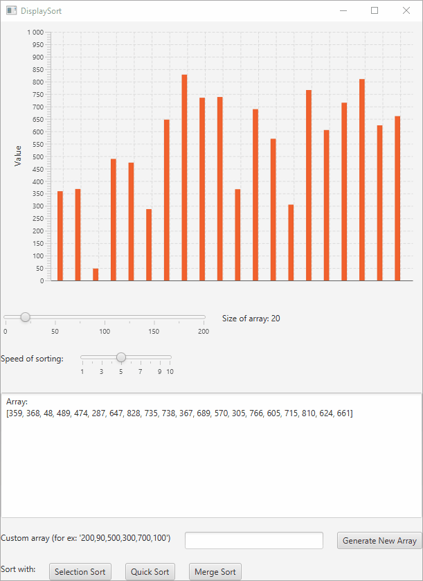

# DisplaySort
Program displaying a graphical view of step-by-step sorting of a list of numbers using common sorting algorithms.



## Usage
Uses Java 8, which includes JavaFX. Tested on Java version: "1.8.0_231". Run with:
```
javac DisplaySort.java && java DisplaySort
```


